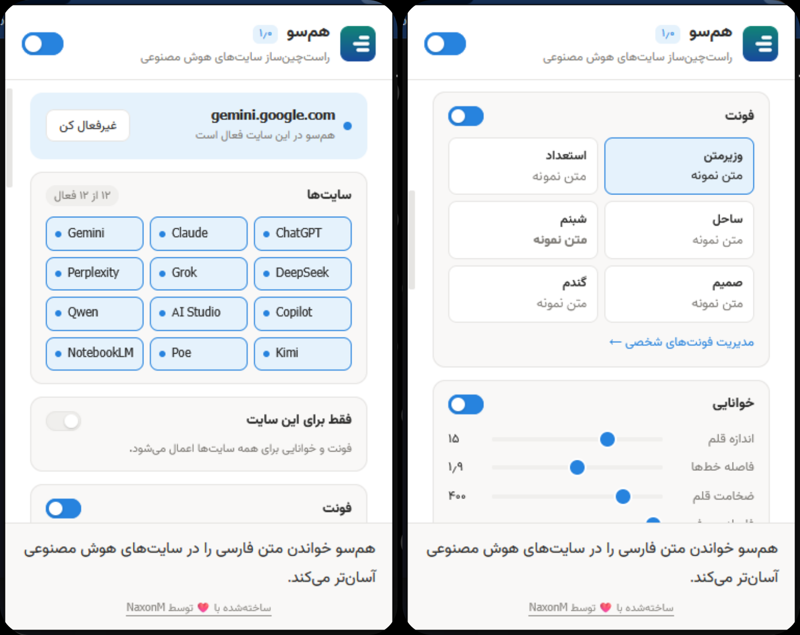
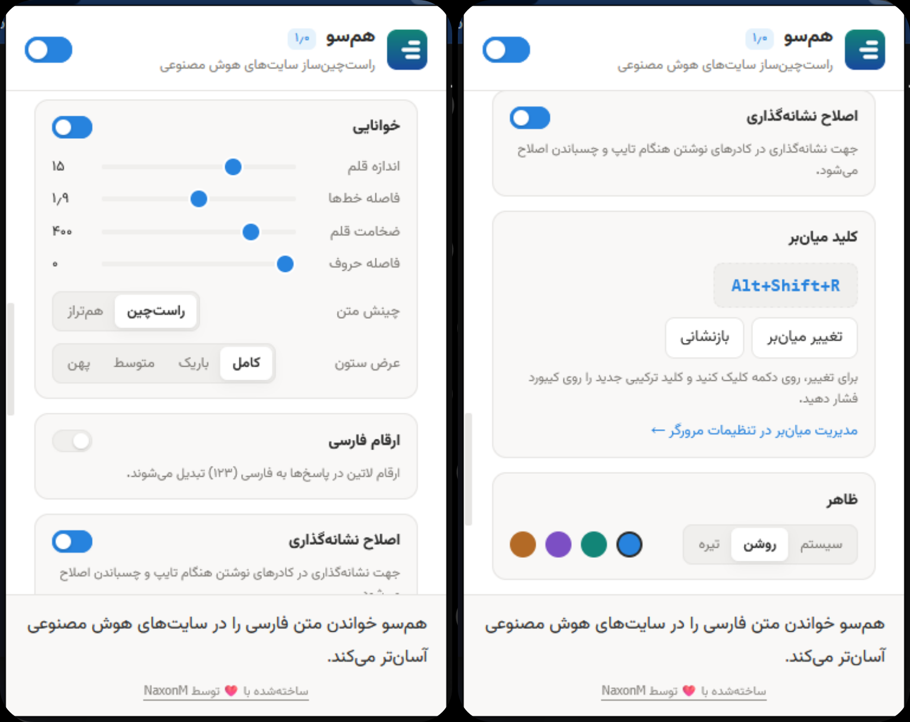

# Hamsoo Extension 🌌

> Persian & RTL typography helper for AI chat sites (ChatGPT, Claude, Gemini, and more).  
> Repository: [https://github.com/NaxonM/hamsoo](https://github.com/NaxonM/hamsoo)

[](src/README-fa.md)

This repository builds two extension variants - **Chromium** and **Firefox** - from a
single shared source tree, so the two are never edited (or drift) separately.

<p align="center">
  
  
</p>

## Layout

```
src/                     Shared extension source (the only place you edit)
manifest.base.json       Common manifest; per-browser bits are injected at build time
build.js                 Generates dist/hamsoo-chromium and dist/hamsoo-firefox
scripts/check.js         Static checks: JS syntax, JSON validity, i18n parity, lint
scripts/bump-version.js  Version + changelog bump (package.json is the source of truth)
test/                    No-dependency test suite (build output, manifests, i18n, locales)
.github/workflows/       CI pipeline
dist/                    Build output (generated; git-ignored)
```

## Commands

```
npm run check       # syntax + JSON + i18n parity + lint
npm run build       # write dist/hamsoo-chromium and dist/hamsoo-firefox
npm test            # build, then run the test suite
npm run verify      # check + build + test (what CI runs)
npm run zip         # build + package dist/hamsoo-*.zip
npm run bump 1.1.0  # set version and add a changelog stub
```

No third-party dependencies are required - everything runs on Node's standard library
(Node >= 18).

## How the two variants differ

The variants are byte-identical except for `manifest.json`:

| | Chromium | Firefox |
|---|---|---|
| background | `service_worker: background.js` | `scripts: [fontdb.js, background.js]` |
| gecko settings | none | `browser_specific_settings.gecko` |

`build.js` enforces this invariant on every build: all non-manifest files must be
byte-identical across the two outputs, or the build fails.

## Loading locally

- **Chromium**: `chrome://extensions` -> Developer mode -> Load unpacked -> `dist/hamsoo-chromium`
- **Firefox**: `about:debugging` -> This Firefox -> Load Temporary Add-on -> `dist/hamsoo-firefox/manifest.json`

## Version & release

`package.json` holds the canonical version. `build.js` injects it into both manifests,
and the popup reads it back at runtime via `runtime.getManifest()`, so there is a single
source of truth. To cut a release:

1. `npm run bump <version>`
2. Edit the new `CHANGELOG.md` entry.
3. `npm run zip` and upload the artifacts from `dist/`.
